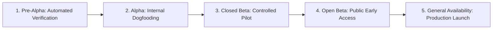

| version | 1.0 |
| name | release-roadmap |
| description | The 5-stage software release testing framework from Pre-Alpha to Production General Availability (GA). |

# 🗺️ SubukAn Release Testing Roadmap

This document defines the release validation phases for the SubukAn QA crowdsourcing platform.

---

## 🎯 Current Status: Phase 1 — Pre-Alpha Testing
We are currently in **Pre-Alpha Testing**. The codebase, schema migrations, and core UI components are built and undergoing rigorous automated verification, unit/integration testing, security validation, and static compilation checks.

---

## 🚦 The 5-Stage Release Testing Pipeline

---

### Phase 1: Pre-Alpha & Automated Verification (📍 CURRENT STAGE)
* **Audience:** Core Developer & Automated Test Suites.
* **Environment:** Local Development (`localhost:3000`) & CI Test Runners.
* **Primary Objective:** Ensure deterministic type safety, schema integrity, zero compilation errors, and complete test suite passes before manual sandbox use.
* **Exit Criteria (Gates to Alpha):**
  * [x] 100% test pass rate across all test suites (`npm run test` $\rightarrow$ 102/102 passing).
  * [x] Zero ESLint warnings or errors (`npm run lint`).
  * [x] Clean Next.js production build (`npm run build`).
  * [x] Automated Preflight Health Check utility (`node scripts/preflight-check.mjs`).
  * [x] Serverless database-backed OTP persistence (`supabase/migrations/00013_create_phone_verifications.sql`).
  * [x] Vercel hourly cron configuration for escrow auto-release (`vercel.json`).
  * [x] Admin dispute moderation & arbitration center (`/dashboard/admin/disputes`).
  * [x] Link integrity audit: all 13 application routes and external links verified.

---

### Phase 2: Alpha Testing (Internal Dogfooding)
* **Audience:** Founder & Internal Developer Team.
* **Environment:** Staging / Local Sandbox Environment.
* **Real Money:** ❌ No (Sandbox simulation mode active).
* **Primary Objective:** Manually test every user journey, edge case, and failure path end-to-end.
* **Action Checklist:**
  1. **Sandbox Campaign Creation:**
     * Create campaigns across all 3 tiers (Micro-Verification, Functional Walk, Usability Audit).
     * Verify PayMongo mock checkout flow and escrow allocation.
  2. **Tester Task Execution:**
     * Claim open testing slots with simulated user accounts.
     * Record screen and microphone audio using Web MediaRecorder API.
     * Test 5-Second Rapid Impression test runner and click coordinate recording.
     * Submit responses and verify transition to `pending_review` status.
  3. **Poster Review & Rejection Workflow:**
     * Review submitted recordings and ratings.
     * Approve submissions and verify mock GCash payout disbursement.
     * Reject submissions with mandatory reasons and test tester dispute filing.
  4. **Admin Moderation & Cron Execution:**
     * Adjudicate active disputes via `/dashboard/admin/disputes` (overrule vs uphold).
     * Trigger `/api/cron/auto-release` manually to confirm expiration safeguards.

---

### Phase 3: Closed Beta Testing (Controlled Pilot)
* **Audience:** 3–5 Real Philippine Builders (Posters) + 10–25 Real Testers (Invite-only).
* **Environment:** Live Production Cloud (Vercel + Supabase Singapore).
* **Real Money:** ✅ Yes (Small, bounded testing budgets: ₱200–₱500 per campaign).
* **Primary Objective:** Test real device diversity (Android/iOS, Chrome/Safari, mobile data networks) and live GCash payment processing with real Philippine users.
* **Action Checklist:**
  1. Verify live phone OTP SMS dispatch via Semaphore API (+63 numbers).
  2. Test real GCash and Maya payments via live PayMongo checkout links.
  3. Verify video and screenshot upload to private Supabase `task-attachments` bucket with signed URL expiration.
  4. Test live GCash cashout disbursements to real tester mobile numbers.
  5. Gather direct feedback on user onboarding, task clarity, and recording permissions.

---

### Phase 4: Open Beta Testing (Public Early Access)
* **Audience:** Public early adopters (Open registration with "Beta" indicator).
* **Environment:** Live Production.
* **Real Money:** ✅ Yes.
* **Primary Objective:** Stress-test platform concurrency, database connection pooling, storage bandwidth, and anti-abuse safeguards under real organic volume.
* **Action Checklist:**
  1. Monitor Supabase connection pooler and database query performance.
  2. Inspect PayMongo webhook delivery logs and verify signature security.
  3. Ensure hourly auto-release cron runs reliably on Vercel.
  4. Collect error telemetry and respond to user bug reports.

---

### Phase 5: General Availability (GA / Commercial Launch)
* **Audience:** Full public launch & commercial market.
* **Environment:** Live Production with commercial SLA.
* **Primary Objective:** Scaled operations, builder acquisition, and enterprise testing campaigns.

